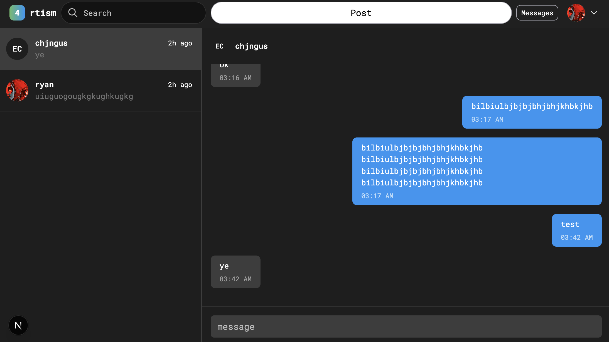
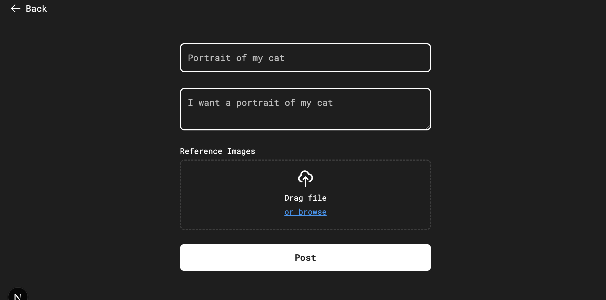
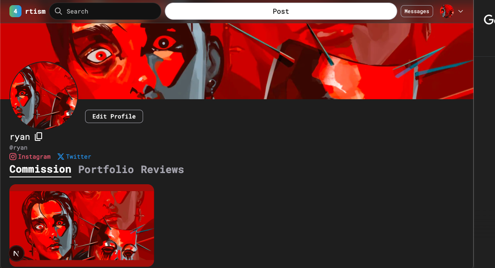
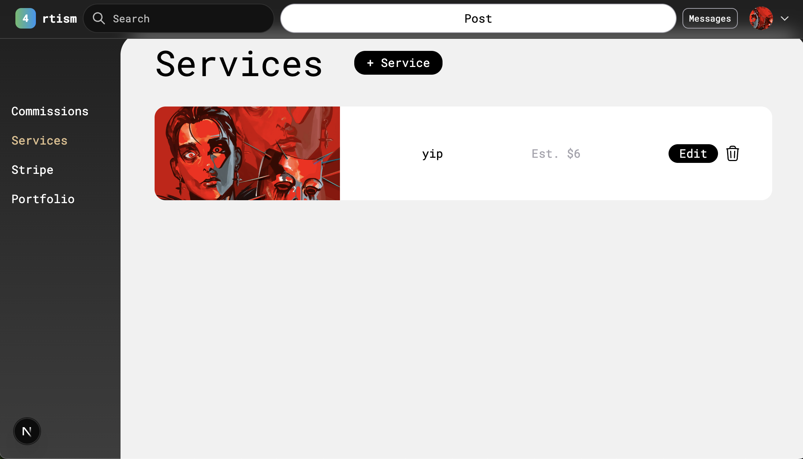
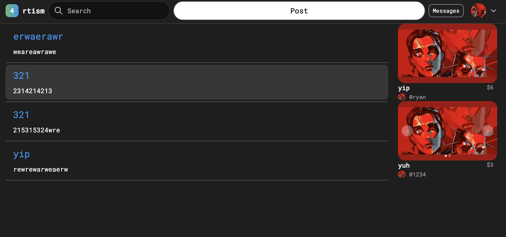

# Hello MLH!
## 4rtism - A platform for artists and art-enjoyers to find each other

## Table of Contents
- [Why](#why)
- [Purpose](#purpose)
- [Usage](#usage)
- [Features](#features)
- [Techstack](#techstack)
- [Lessons](#lessons)
- [Future](#future)
- [Images](#images)

## Why?
1. It's difficult for artists to find clients for art commissions. Most artists do it through discord servers or mutuals, but it's hard to find new clientele because there's no singular platform for it.
2. On the flip side, it's also hard for clients to find an artist tailored for what you want
3. Popular art commission websites take high fees for transactions
## Purpose:
1. To provide a platform for artists to find commission opportunities.
2. To allow art-enjoyers to view and contact artists willing to work with them
3. To provide a cheaper alternative to other art commission websites
## Usage
- The website is currently deployed with Vercel [at this link](https://art-commission-cdcaev0fq-aggamundus-projects.vercel.app)
  
To run the app for development  
1. Clone this repo
2. in the terminal run `npm install` and `npm run dev`.

Keep in mind that you cannot write to the database due to env variables
## Features
- Messaging
- Payment
- Profile
- Search
- Client commission posts
- Commission requests
- Commission Services
- Dashboard
- Emailing
- Reviews

## Techstack
- Typescript
- next.js
- Supabase (PostgreSQL)
- Stripe
- Sendgrid (emails)
- Vercel

## Lessons
1. Thoughtfully planning what you want to make, and also enjoying your planned design, saves you loads of time.
  > I wasted around 2.5 weeks redoing the frontend of 4rtism because I didn't like it. If I had just spent a bit more time refining the design in Figma, I could have saved myself alot of time and energy.
2. You need to lint your code while you develop.
  > When trying to deploy, I had like 150+ linter errors. If I had `npm run build` and read the errors while I developed, then I would've learned more and simulatenously saved myself future headache
3. I need to write cleaner code
  > Going into this project, I had the mindset that "I don't need to write clean code if it works". Well, after making a larger codebase, I've internalized the importance of writing reusable code, and I *solemnly plan* to do so in the future. It not only saves you time, but embarassment from other people looking at your 15 hooks in a single component.

## Future
- 4rtism is not currently ready for users, but will be very soon!

## Images
- A couple pages are not included. The data is test data.

